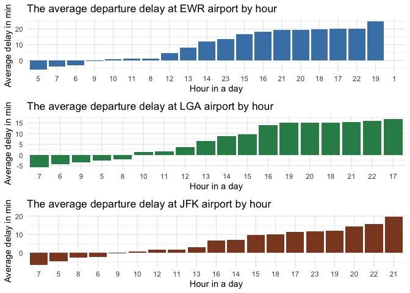
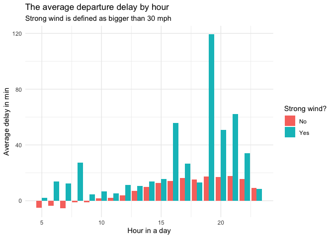
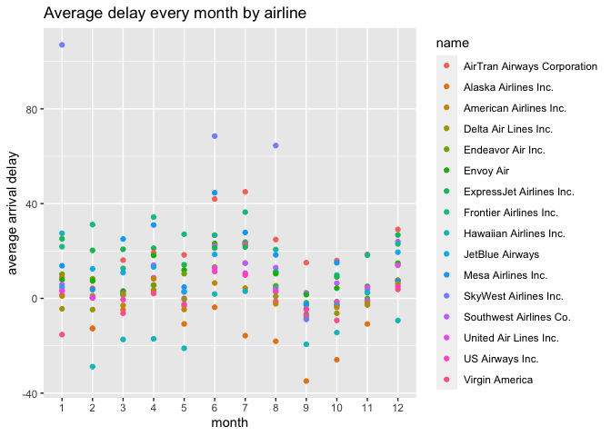
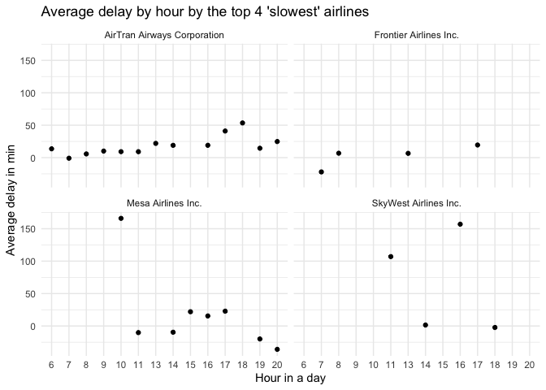

HW Week4
================
Isabella Xue

## Github link

`https://github.com/isabellaxue/STAT433.git`

## Introduction

I focus on **airport**, **wind speed**, **airline** to find the best
ways to avoid delays. Here are the findings:

1.  Average delay time by hour vary slightly in different airport:

<!-- end list -->

1)  at **5, 7, 6** o’clock, flights are least likely to delay at EWR
    airport.
2)  at **7, 6, 9** o’clock, flights are least likely to delay at LGA
    airport.
3)  at **7, 5, 8** o’clock, flights are least likely to delay at JFK
    airport.

<!-- end list -->

2.  The combination of strong wind (high wind speed) + late hours is
    related to great increase in delay. It is highly recommended to fly
    early if you know it is going to be windy.

3.  The four airlines *SkyWest Airlines, AirTran Airways, Mesa Airlines,
    Frontier Airlines* that have greater delay overall (by month) have
    some pattern when looking specifically by hour:

<!-- end list -->

1)  with AirTran Airways, passenger should avoid flying around **17,
    18** o’clock
2)  with Frontier Airline, passenger should avoid flying around **17**
    o’clock
3)  with Mesa Airlines, passenger should avoid flying around **10**
    o’clock
4)  with SkyWest Airlines, passenger should avoid flying around **16,
    11** o’clock

## Airport

For visualization purpose, I first made 3 separate table containing the
average delay from 3 airports by hour.

``` r
ewr_hour <- flights %>% 
  filter(origin == "EWR") %>%
  group_by(hour) %>%
  summarise(arr_delay = mean(arr_delay, na.rm = TRUE)) %>%
  mutate(hour = as.character(hour)) %>%
  arrange(arr_delay)

lga_hour <- flights %>% 
  filter(origin == "LGA") %>%
  group_by(hour) %>%
  summarise(arr_delay = mean(arr_delay, na.rm = TRUE)) %>%
  arrange(arr_delay)

jfk_hour <- flights %>% 
  filter(origin == "JFK") %>%
  group_by(hour) %>%
  summarise(arr_delay = mean(arr_delay, na.rm = TRUE)) %>%
  arrange(arr_delay) 

ewr_hour
```

    ## # A tibble: 20 × 2
    ##    hour  arr_delay
    ##    <chr>     <dbl>
    ##  1 5        -5.75 
    ##  2 7        -3.96 
    ##  3 6        -3.27 
    ##  4 9        -0.373
    ##  5 10        0.805
    ##  6 11        1.02 
    ##  7 8         1.20 
    ##  8 12        4.70 
    ##  9 13        8.14 
    ## 10 14       12.0  
    ## 11 23       13.6  
    ## 12 15       16.9  
    ## 13 16       18.2  
    ## 14 21       19.4  
    ## 15 20       19.6  
    ## 16 18       19.7  
    ## 17 17       20.1  
    ## 18 22       20.2  
    ## 19 19       24.9  
    ## 20 1       NaN

``` r
lga_hour
```

    ## # A tibble: 18 × 2
    ##     hour arr_delay
    ##    <dbl>     <dbl>
    ##  1     7     -5.67
    ##  2     6     -4.44
    ##  3     9     -3.39
    ##  4     5     -2.61
    ##  5     8     -1.93
    ##  6    10      1.44
    ##  7    11      1.68
    ##  8    12      3.67
    ##  9    13      6.57
    ## 10    14      8.83
    ## 11    15      9.75
    ## 12    16     13.9 
    ## 13    19     15.1 
    ## 14    20     15.2 
    ## 15    18     15.2 
    ## 16    21     15.3 
    ## 17    22     15.9 
    ## 18    17     16.8

``` r
jfk_hour
```

    ## # A tibble: 19 × 2
    ##     hour arr_delay
    ##    <dbl>     <dbl>
    ##  1     7    -6.58 
    ##  2     5    -4.56 
    ##  3     8    -2.55 
    ##  4     6    -2.16 
    ##  5     9    -0.173
    ##  6    10     0.615
    ##  7    12     1.59 
    ##  8    11     1.72 
    ##  9    13     3.15 
    ## 10    16     6.79 
    ## 11    14     7.08 
    ## 12    15     9.61 
    ## 13    18    10.1  
    ## 14    17    11.4  
    ## 15    23    11.7  
    ## 16    19    12.2  
    ## 17    20    14.2  
    ## 18    22    15.9  
    ## 19    21    19.7

Then, I created bar graph showing average delay at each airport.

``` r
ewr_plot <- ggplot(ewr_hour, aes(x=reorder(hour, arr_delay), y=arr_delay)) +
  geom_bar(stat="identity", fill="steelblue") +
  labs(x = "Hour in a day", y = "Average delay in min",
       title = "The average departure delay at EWR airport by hour") +
  theme(plot.title = element_text(hjust = 0.5)) +
  theme_minimal()

lga_plot <- ggplot(lga_hour, aes(x=reorder(hour, arr_delay), y=arr_delay)) +
  geom_bar(stat="identity", fill="seagreen4") +
  labs(x = "Hour in a day", y = "Average delay in min",
       title = "The average departure delay at LGA airport by hour") +
  theme(plot.title = element_text(hjust = 0.5)) +
  theme_minimal()

jfk_plot <- ggplot(jfk_hour, aes(x=reorder(hour, arr_delay), y=arr_delay)) +
  geom_bar(stat="identity", fill="sienna4") +
  labs(x = "Hour in a day", y = "Average delay in min",
       title = "The average departure delay at JFK airport by hour") +
  theme(plot.title = element_text(hjust = 0.5)) +
  theme_minimal()

plot_grid(ewr_plot, lga_plot, jfk_plot, nrow = 3, ncol =1)
```

    ## Warning: Removed 1 rows containing missing values (position_stack).

<!-- -->

It’s very useful to look at each airport separately to avoid flight
delay. After grouping by airport, I found the average departure delay by
hour and sort them in ascending order to show in plots. It is shown in
the plots that

1)  at **5, 7, 6** o’clock, flights are least likely to delay at EWR
    airport.
2)  at **7, 6, 9** o’clock, flights are least likely to delay at LGA
    airport.
3)  at **7, 5, 8** o’clock, flights are least likely to delay at JFK
    airport.

## Weather

I chose to show whether wind speed has influence on the average delay by
hour. I used left\_join to combine flights and weather dataframe. I
defined “strong wind” as the variable wind\_speed bigger than 30 mph
(based on information I got from internet). Then I created bar graph by
studying average delay separately when strong wind is present or not.

``` r
flight_weather <- flights %>% 
  group_by(year, month, day, hour) %>%
  summarise(arr_delay = mean(arr_delay, na.rm = TRUE)) %>%
  left_join(weather, by = c("year", "month", "day", "hour")) %>%
  mutate(strong_wind = ifelse((wind_speed > 30), 1, 0)) %>%
  group_by(hour, strong_wind) %>%
  summarise(arr_delay = mean(arr_delay, na.rm = TRUE)) %>%
  filter(!is.na(strong_wind), !is.na(arr_delay)) %>%
  mutate(strong_wind = as.factor(strong_wind)) 
```

    ## `summarise()` has grouped output by 'year', 'month', 'day'. You can override using the `.groups` argument.

    ## `summarise()` has grouped output by 'hour'. You can override using the `.groups` argument.

``` r
flight_weather
```

    ## # A tibble: 38 × 3
    ## # Groups:   hour [19]
    ##     hour strong_wind arr_delay
    ##    <dbl> <fct>           <dbl>
    ##  1     5 0               -5.02
    ##  2     5 1                2   
    ##  3     6 0               -3.51
    ##  4     6 1               13.9 
    ##  5     7 0               -5.57
    ##  6     7 1               12.3 
    ##  7     8 0               -1.17
    ##  8     8 1               27.1 
    ##  9     9 0               -1.15
    ## 10     9 1                4.38
    ## # … with 28 more rows

``` r
ggplot(flight_weather, aes(x=hour, y=arr_delay, fill = strong_wind)) +
  geom_bar(stat="identity", position=position_dodge()) +
  scale_fill_discrete(name = "Strong wind?", labels = c("No", "Yes")) +
  labs(x = "Hour in a day", y = "Average delay in min") +
  ggtitle(label = "The average departure delay by hour",
              subtitle = "Strong wind is defined as bigger than 30 mph") +
  theme(plot.title = element_text(hjust = 0.5, size = 13, face = "bold"), 
        plot.subtitle = element_text(hjust = 0.5)) +
  theme_minimal()
```

<!-- -->

From the graph, we can see that strong wind does have a effect on the
average delay time: the average delay is so much higher in the later
hours when strong wind is present. There is one takeaway from this:
strong wind + late hours are terrible\! Fly early if you know it is
going to be windy.

## Airline

First, I want to know what airlines have the longest average delay
monthly to get an big picture of each airline.

``` r
flights %>% 
  left_join(airlines, by = "carrier") %>%
  group_by(year, month, name) %>%
  summarise(arr_delay = mean(arr_delay, na.rm = TRUE)) %>% 
  mutate(month = as.factor(month)) %>%
  arrange(desc(arr_delay)) %>%
  ggplot(aes(x=month, y=arr_delay, color = name)) +
  geom_point() +
  labs(y= "average arrival delay", title = "Average delay every month by airline")
```

    ## `summarise()` has grouped output by 'year', 'month'. You can override using the `.groups` argument.

<!-- -->

From the graph, we can see that **SkyWest Airlines, AirTran Airways,
Mesa Airlines, Frontier Airlines** stand out as having greater average
delay every month. Therefore, I want to see at what hours passenger
should avoid to fly with these airlines.

``` r
airline_delay <- flights %>% 
  left_join(airlines, by = "carrier") %>%
  filter(name == c("Mesa Airlines Inc.", "SkyWest Airlines Inc.", "AirTran Airways Corporation", "Frontier Airlines Inc.")) %>%
  group_by(hour, name) %>%
  summarise(arr_delay = mean(arr_delay, na.rm = TRUE)) %>%
  mutate(hour = as.factor(hour))
```

    ## `summarise()` has grouped output by 'hour'. You can override using the `.groups` argument.

``` r
airline_delay
```

    ## # A tibble: 29 × 3
    ## # Groups:   hour [14]
    ##    hour  name                        arr_delay
    ##    <fct> <chr>                           <dbl>
    ##  1 6     AirTran Airways Corporation    13.6  
    ##  2 7     AirTran Airways Corporation    -0.889
    ##  3 7     Frontier Airlines Inc.        -22    
    ##  4 8     AirTran Airways Corporation     5.74 
    ##  5 8     Frontier Airlines Inc.          6.84 
    ##  6 9     AirTran Airways Corporation    10.1  
    ##  7 10    AirTran Airways Corporation     9.20 
    ##  8 10    Mesa Airlines Inc.            166    
    ##  9 11    AirTran Airways Corporation     9.20 
    ## 10 11    Mesa Airlines Inc.            -10.2  
    ## # … with 19 more rows

``` r
ggplot(airline_delay, aes(x=hour, y=arr_delay)) +
  geom_point() +
  labs(x = "Hour in a day", y = "Average delay in min",
       title = "Average delay by hour by the top 4 'slowest' airlines") +
  theme(plot.title = element_text(hjust = 0.5, size = 13, face = "bold"))+
  theme_minimal() +
  facet_wrap(~name)
```

<!-- -->

The graphs above give an abstract idea that

1)  with AirTran Airways, passenger should avoid flying around **17,
    18** o’clock
2)  with Frontier Airline, passenger should avoid flying around **17**
    o’clock
3)  with Mesa Airlines, passenger should avoid flying around **10**
    o’clock
4)  with SkyWest Airlines, passenger should avoid flying around **16,
    11** o’clock
