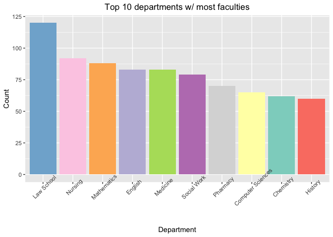

HW\_Week2
================
Isabella Xue

## Github url

*<https://github.com/isabellaxue/STAT433.git>*

## Implementing data from webpage

``` r
url_l <- "https://guide.wisc.edu/faculty/"
website_html <- read_html(url_l)
text_website <- website_html %>% 
  html_elements(".uw-people") %>%
  html_text2()

final_df <- data.frame(matrix(ncol = 4, nrow = 0))
col_n <- c("Name", "Position", "Department", "Degree")
colnames(final_df) <- col_n

for (row_t in text_website) {
  row_split <- strsplit(row_t, "\n\n\n")
  row_split <- row_split[[1]]
  for(i in 1:length(row_split)){
    if (str_count(row_split[i], "\n") < 3) {
      next
      }
    person_r <- strsplit(row_split[i], "\n")
    person_r <- person_r[[1]]
    final_df[nrow(final_df) + 1, ] = person_r
  }
}

head(final_df)
```

    ##                   Name              Position              Department
    ## 1      ABBOTT,DAVID H.             Professor Obstetrics & Gynecology
    ## 2   ABD-ELSAYED,ALAA A Assoc Professor (Chs)          Anesthesiology
    ## 3     ABDUALLAH,FAISAL             Professor                     Art
    ## 4 ABRAHAM,OLUFUNMILOLA   Assistant Professor                Pharmacy
    ## 5      ABRAMS,SAMANTHA        Assoc Lecturer      Information School
    ## 6         ABRAMSON,LYN             Professor              Psychology
    ##                                Degree
    ## 1    PHD 1979 University of Edinburgh
    ## 2        MD 2000 University of Assiut
    ## 3       PHD 2012 Royal College of Art
    ## 4  PHD 2013 Univ of Wisconsin-Madison
    ## 5   MA 2017 Univ of Wisconsin-Madison
    ## 6 PHD 1978 University of Pennsylvania

## Plotting

``` r
new_df <- final_df %>%
  group_by(Department) %>%
  summarise(Count = n()) %>%
  arrange(desc(Count))
new_df <- new_df[1:10,]
ggplot(new_df, aes(x=reorder(Department, -Count), y=Count, fill = Department)) +
  geom_bar(stat="identity") +
  theme(axis.text.x = element_text(angle = 45), plot.title = element_text(hjust = 0.5), legend.position="none") +
  ggtitle("Top 10 departments w/ most faculties") +
  labs(x = "Department") +
  scale_fill_brewer(palette = "Set3")
```

<!-- -->
