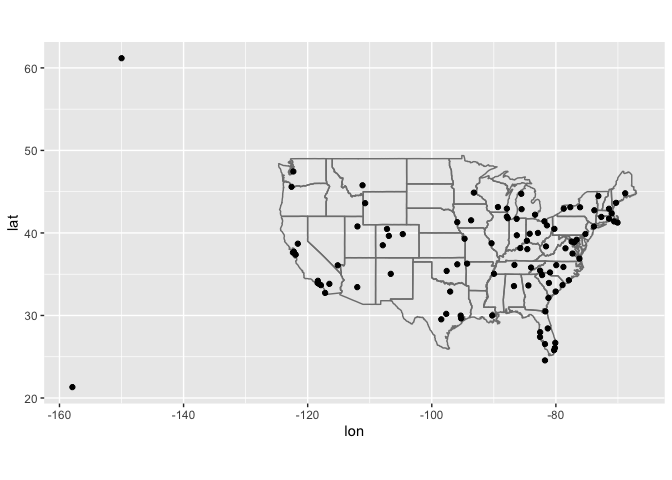
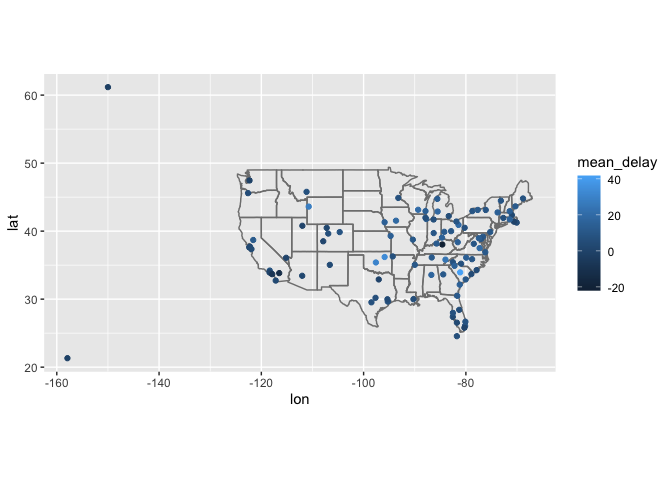
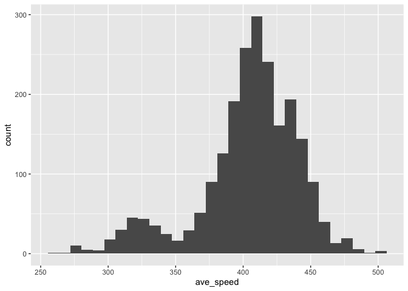

midterm
================
Isabella Xue

## Midterm.

## Github link

`https://github.com/isabellaxue/STAT433.git`

#### 1\. Map the delay by destination.

Compute the average delay by destination, then join on the airports data
frame so you can show the spatial distribution of delays. Here’s an
easy way to draw a map of the United States. You are welcome to use this
code or some other code.

``` r
library(tidyverse)
```

    ## ─ Attaching packages ──────────────────── tidyverse 1.3.1 ─

    ## ✓ ggplot2 3.3.5     ✓ purrr   0.3.4
    ## ✓ tibble  3.1.4     ✓ dplyr   1.0.7
    ## ✓ tidyr   1.1.3     ✓ stringr 1.4.0
    ## ✓ readr   2.0.1     ✓ forcats 0.5.1

    ## ─ Conflicts ───────────────────── tidyverse_conflicts() ─
    ## x dplyr::filter() masks stats::filter()
    ## x dplyr::lag()    masks stats::lag()

``` r
library(nycflights13)
  
airports %>%
  semi_join(flights, c("faa" = "dest")) %>%
  ggplot(aes(lon, lat)) +
  borders("state") +
  geom_point() +
  coord_quickmap()
```

<!-- -->

You might want to use the size or colour of the points to display the
average delay for each airport.

``` r
# flights
# planes
# airlines
# airports
# weather

# put your answer here.
flights %>% 
  group_by(dest) %>%
  summarise(mean_delay = mean(arr_delay, na.rm = T)) %>%
  left_join(airports, c("dest" = "faa")) %>%
  ggplot(aes(lon, lat, color = mean_delay)) +
  borders("state") +
  geom_point() +
  coord_quickmap()
```

    ## Warning: Removed 4 rows containing missing values (geom_point).

<!-- -->

#### 2\. Do planes trade ownership?

You might expect that there’s an implicit relationship between plane
and airline, because each plane is flown by a single airline. Explore
this conjecture using data. (Let’s assume that the tail number of a
plane does not change.)

``` r
# put your answer here. 
flights %>%
  mutate(count_p = 1) %>%
  group_by(tailnum, carrier) %>%
  summarise(n = sum(count_p)) %>%
  drop_na() %>%
  group_by(tailnum) %>%
  summarise(n_unique = n()) %>%
  filter(n_unique > 1)
```

    ## `summarise()` has grouped output by 'tailnum'. You can override using the `.groups` argument.

    ## # A tibble: 17 × 2
    ##    tailnum n_unique
    ##    <chr>      <int>
    ##  1 N146PQ         2
    ##  2 N153PQ         2
    ##  3 N176PQ         2
    ##  4 N181PQ         2
    ##  5 N197PQ         2
    ##  6 N200PQ         2
    ##  7 N228PQ         2
    ##  8 N232PQ         2
    ##  9 N933AT         2
    ## 10 N935AT         2
    ## 11 N977AT         2
    ## 12 N978AT         2
    ## 13 N979AT         2
    ## 14 N981AT         2
    ## 15 N989AT         2
    ## 16 N990AT         2
    ## 17 N994AT         2

`17` planes are traded between airlines.

#### 3a. Plane’s average speed.

Notice that `flights$air_time` is in minutes. Make a new column that is
the air time in hours.

``` r
# put your answer here.  
flights %>%
  mutate(air_time_h = air_time/60) %>%
  select(air_time,air_time_h)
```

    ## # A tibble: 336,776 × 2
    ##    air_time air_time_h
    ##       <dbl>      <dbl>
    ##  1      227      3.78 
    ##  2      227      3.78 
    ##  3      160      2.67 
    ##  4      183      3.05 
    ##  5      116      1.93 
    ##  6      150      2.5  
    ##  7      158      2.63 
    ##  8       53      0.883
    ##  9      140      2.33 
    ## 10      138      2.3  
    ## # … with 336,766 more rows

#### 4b. Average speed

For each flight, compute the average speed of that flight (in miles per
hour). Then, for each plane, compute the average of those average
speeds. Display it in a histogram. You can use a base R histogram `hist`
or ggplot’s `geom_histogram`.

``` r
# put your answer here.  
flights %>%
  mutate(air_time_h = air_time/60) %>%
  group_by(tailnum) %>%
  summarise(ave_speed = mean(distance/air_time_h)) %>%
  ggplot(aes(ave_speed)) +
  geom_histogram()
```

    ## `stat_bin()` using `bins = 30`. Pick better value with `binwidth`.

    ## Warning: Removed 1855 rows containing non-finite values (stat_bin).

<!-- -->

#### 5\. Bonus

Make a table where each row is a destination, each column is a carrier,
and each element is the number of times that the carrier has flown to
that destination. Ensure that you only count flights that arrived at the
destination.

``` r
# put answer here
flights %>%
  filter(!is.na(dest)) %>%
  group_by(carrier, dest) %>% 
  summarise(n = n()) %>%
  pivot_wider(names_from = carrier, values_from = n, values_fill = 0)
```

    ## `summarise()` has grouped output by 'carrier'. You can override using the `.groups` argument.

    ## # A tibble: 105 × 17
    ##    dest   `9E`    AA    AS    B6    DL    EV    F9    FL    HA    MQ    OO    UA
    ##    <chr> <int> <int> <int> <int> <int> <int> <int> <int> <int> <int> <int> <int>
    ##  1 ATL      59     0     0     0 10571  1764     0  2337     0  2322     0   103
    ##  2 AUS       2   365     0   747   357     0     0     0     0     0     0   670
    ##  3 AVL      10     0     0     0     0   265     0     0     0     0     0     0
    ##  4 BGR       1     0     0     0     0   374     0     0     0     0     0     0
    ##  5 BNA     474     0     0     0     1  2170     0     0     0  2404     0     0
    ##  6 BOS     914  1455     0  4383   972   159     0     0     0     0     0  3342
    ##  7 BTV       2     0     0  1364     0  1223     0     0     0     0     0     0
    ##  8 BUF     833     0     0  2803     3  1042     0     0     0     0     0     0
    ##  9 BWI     856     0     0     0     0   352     0     0     0   365     0     0
    ## 10 CAE       3     0     0     0     0   113     0     0     0     0     0     0
    ## # … with 95 more rows, and 4 more variables: US <int>, VX <int>, WN <int>,
    ## #   YV <int>
